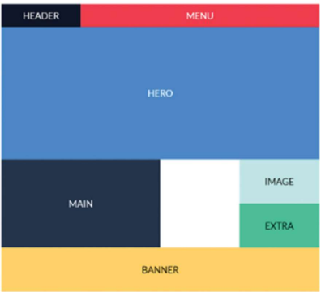
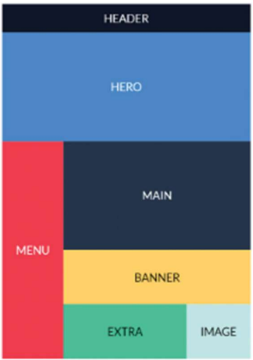
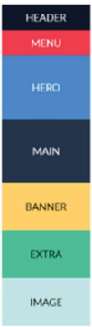

# ESTUDIO DE GRID CON MEDIA QUERIES
## DESCRIPCIÓN:
- La página web se podrá visualizar en tres dispositivos diferentes (_escritorio_, _tablet_ y _móvil_).
- Las reglas para cambiar los diseños usando _media queries_ serán:
    1. __A partir de 1200px__: Diseño a tres columnas (_escritorio_).
    2. __A partir de 600px y hasta 1200px__: Diseño a dos columnas (_tablet_).
    3. __Hasta 600px__: Diseño con una única columna (_móvil_).
## ASPECTO FINAL:
1. __Escritorio__:

    

2. __Tablet__:

    

3. __Móvil__:

    